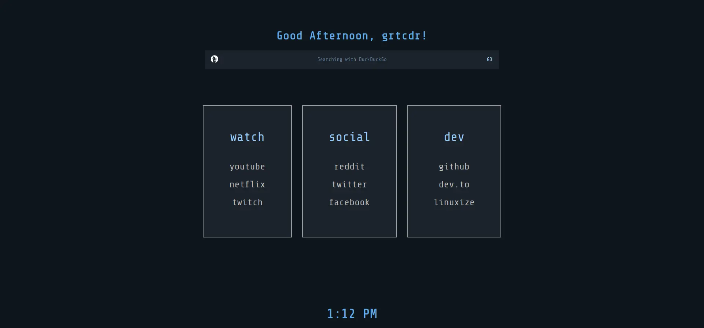
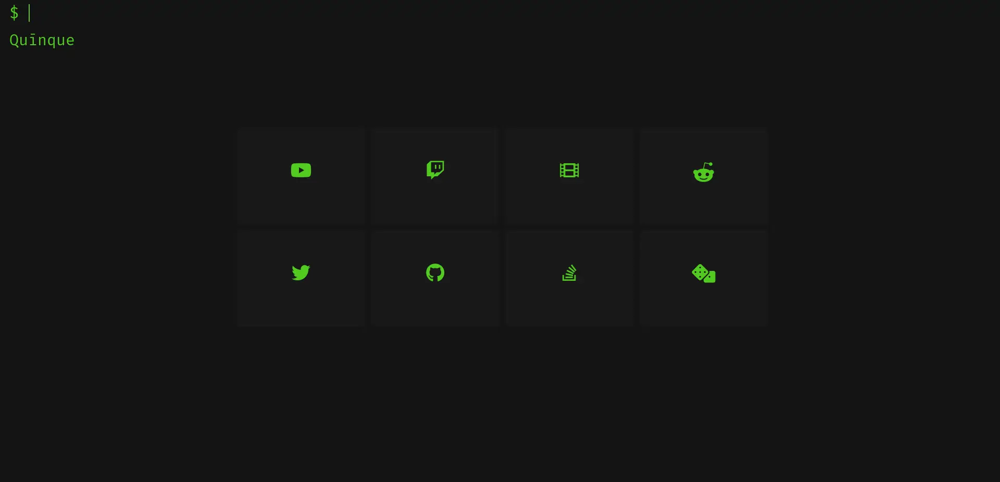

<h1>grtcdr's startpages</h1>

<h3>startpage_1</h3>

<h3>startpage_2</h3>

<h3>startpage_3</h3>

<h3>startpage_4</h3>

<h3>startpage_5</h3>

<h3>startpage_6</h3>

<h3>startpage_7</h3>

---

## Description 

Each startpage folder contains: 
- Source code within __src/__
- Preview of the startpage
- Brief description of the startpage

---

## Set Startpage As New Tab Page 
### Build & Sign The Extension
I use `web-ext` to build and sign my startpage extensions, please note that any modifications you make to the startpages won't take effect unless the extension is rebuilt.

1. Clone the repository: `git clone https://github.com/grtcdr/startpages`
2. Jump inside: `cd startpages`
2. Install `web-ext` by following the guide over in its [GitHub Repository](https://github.com/mozilla/web-ext) or from your distribution's official repositories.
3. In your terminal, navigate to __src/__ of your desired startpage and run: `web-ext sign --api-key=$AMO_JWT_ISSUER --api-secret=$AMO_JWT_SECRET`

For more information on how to obtain your `api-key` and `api-secret`, [read this guide by Mozilla.](https://extensionworkshop.com/documentation/develop/getting-started-with-web-ext/) Signing an extension is talked about under _"Signing your extension for self-distribution"_

_I'm not the only person making these, there's a whole community just as passionate about spicing up the once boring space most people forget about! You can find many more startpages on reddit at **r/startpages**!_
