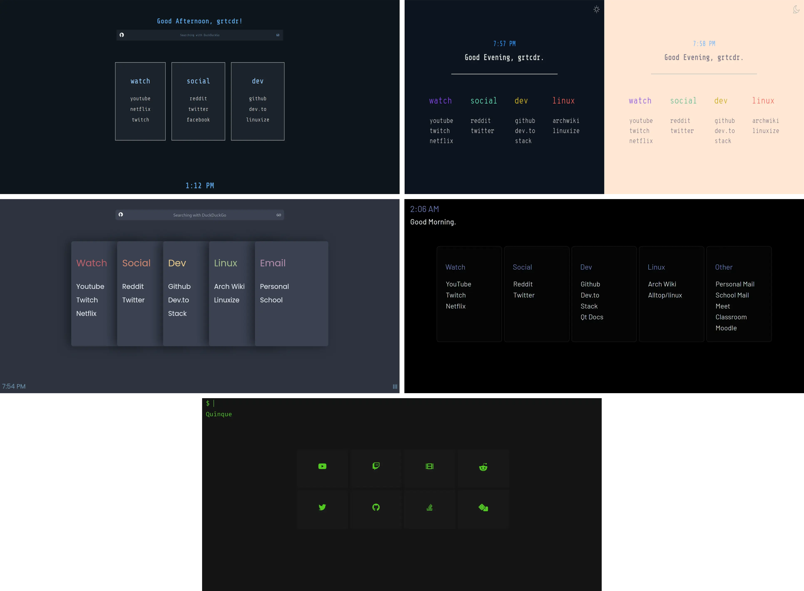

# grtcdr's startpages

  

## Table of Contents:
- [Description](#description)
- [Recent Changes](#recent)
- [Set Startpage as New Tab Page](#set-startpage)

---

## Description 

Each startpage folder contains: 
- Source code within __src/__
- Preview of the startpage
- Brief description of the startpage

### Recent Changes: 
Extensions will no longer be shipped in the repository, as it has recently come to my attention
that the .xpi files signed (and generated) by web-ext should not be packaged outside of Firefox's add-on market (and I also __do not recommend__ that you install a stranger's xpi files).

---

## Set startpage as new tab page 
### Build the extension
I use __web-ext__ to build and sign my startpage extensions, you will want to rebuild the extension if you want your modifications to the source codes to apply to the extension

1. Let's clone the repo: `git clone https://github.com/grtcdr/startpages`
2. Install Mozilla's web-ext by following their guide on their [github repository](https://github.com/mozilla/web-ext) or from your distribution's official repository.
3. In your terminal, navigate to __src/__ of your desired startpage and run: ` web-ext sign --api-key=$AMO_JWT_ISSUER --api-secret=$AMO_JWT_SECRET`

For more information on how to obtain your __api-key__ and __api-secret__, [read this guide by Mozilla.](https://extensionworkshop.com/documentation/develop/getting-started-with-web-ext/)
Web-ext sign is talked about under _"Signing your extension for self-distribution"_

_I'm not the only person making these, there's a whole community just as passionate about spicing up the once boring space most people forget about! You can find many more startpages on reddit at **r/startpages**!_