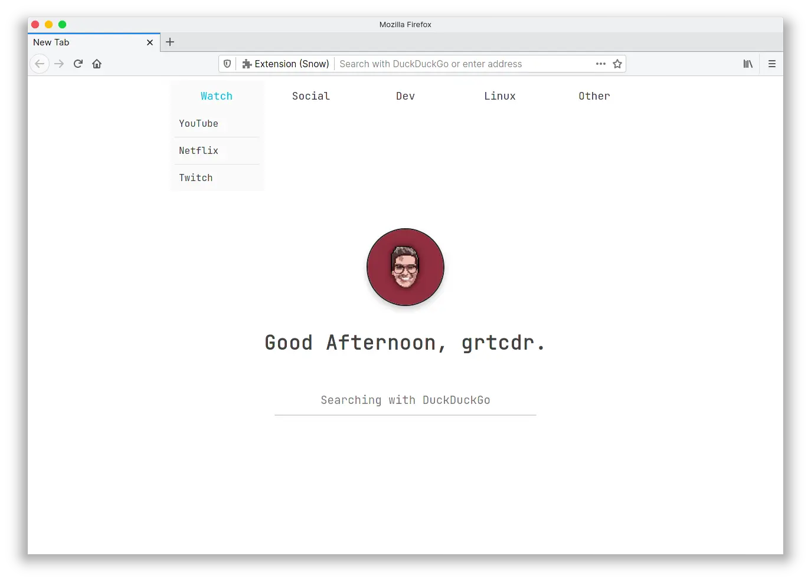

<div align="center">
<h1>grtcdr's startpages</h1>

<a href="https://github.com/grtcdr/startpages/blob/master/LICENSE">
    
</a>

<a href="https://github.com/grtcdr/startpages/stargazers">
    
</a>

<a href="https://github.com/grtcdr/startpages/network/members">
    
</a>

<h4>A preview of one of the startpages</h4>



</div>

---

## 📝 Description <a name="description"></a>

Each startpage folder contains: 
- Source code within __src/__
- Preview of the startpage
- Brief description of the startpage

---

## Set Startpage As New Tab Page <a name="set-startpage"></a>
### 🔨 Build & Sign The Extension
I use `web-ext` to build and sign my startpage extensions, please note that any modifications you make to the startpages won't take effect unless the extension is rebuilt.

🚨 Please note that this is **not the only way** to set my startpages as a new tab page, it is just the way I do it.

#### Prerequisites
- `web-ext`
You can install it by following the guide over in its [GitHub Repository](https://github.com/mozilla/web-ext) or from your distribution's official repositories.
#### Building The Extension
In your terminal:

1. Clone the repository:
```
git clone https://github.com/grtcdr/startpages
```
3. Jump inside the repository:
```
cd startpages
```
4. Navigate inside the __src__ directory of your desired startpage. 
Let's use _startpage_7_ as an example:
```
cd startpage_7/src
```
5. Sign the extension
```
`web-ext sign --api-key=$AMO_JWT_ISSUER --api-secret=$AMO_JWT_SECRET`
```

For more information on how to obtain your `api-key` and `api-secret`, [read this guide by Mozilla.](https://extensionworkshop.com/documentation/develop/getting-started-with-web-ext/) Signing an extension is talked about under _"Signing your extension for self-distribution"_

_I'm not the only person making these, there's a whole community just as passionate about spicing up the once boring space most people forget about! You can find many more startpages on reddit at **r/startpages**!_